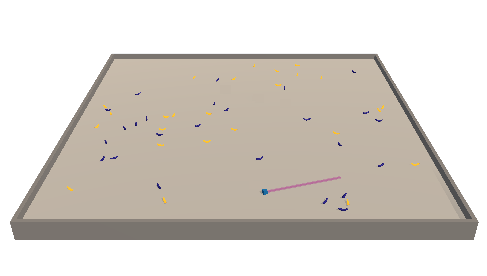

### Udacity Deep Reinforcement Learning Nanodegree - Project 1 

# Navigation 
## Use Q-learning to train an Agent to Collect Bananas
 

*The Agent must navigate a world, collecting yellow banana while avoiding blue ones*
  

    

*The movie above is from an Agent I have trained...* 

The environment is similar to Unity's [Banana Collector environment](https://github.com/Unity-Technologies/ml-agents/blob/master/docs/Learning-Environment-Examples.md#banana-collector)

## Introduction - Project Details

An agent must be trained an agent to navigate (and collect bananas!) in a large, square world.

    

A reward of +1 is provided for collecting a yellow banana, and a reward of -1 is provided for collecting a blue banana.  Thus, the goal of the agent is to collect as many yellow bananas as possible while avoiding blue bananas.  

The state space has 37 dimensions and contains the agent's velocity, along with ray-based perception of objects around agent's forward direction.  Given this information, the agent has to learn how to best select actions.  Four discrete actions are available, corresponding to:

- **`0`** - move forward.
- **`1`** - move backward.
- **`2`** - turn left.
- **`3`** - turn right.

The task is episodic, and in order to solve the environment, the agent must get an average score of +13 over 100 consecutive episodes. Which means that once trained to score 13 points in an episode the Agent must continue scoring an average of at least 13 for the next 100 episodes... 

The code is based on the [DRLND solution](https://github.com/udacity/deep-reinforcement-learning/blob/master/dqn/solution/Deep_Q_Network_Solution.ipynb) for a Deep Q-Network agent that implements an OpenAI Gym LunarLander-v2 environment.  

## Getting Started

1. Download this GitHub repository, which is based on the original `p1_navigation` project found in the Udacity [deep-reinforcement-learning](https://github.com/udacity/deep-reinforcement-learning.git) (DRLND) GitHub repository
	 
2. Download the Banana environment from one of the links below.  You need only select the environment that matches your operating system:
    - Linux: [click here](https://s3-us-west-1.amazonaws.com/udacity-drlnd/P1/Banana/Banana_Linux.zip)
    - Mac OSX: [click here](https://s3-us-west-1.amazonaws.com/udacity-drlnd/P1/Banana/Banana.app.zip)
    - Windows (32-bit): [click here](https://s3-us-west-1.amazonaws.com/udacity-drlnd/P1/Banana/Banana_Windows_x86.zip)
    - Windows (64-bit): [click here](https://s3-us-west-1.amazonaws.com/udacity-drlnd/P1/Banana/Banana_Windows_x86_64.zip)
    
    (_For Windows users_) Check out [this link](https://support.microsoft.com/en-us/help/827218/how-to-determine-whether-a-computer-is-running-a-32-bit-version-or-64) if you need help with determining if your computer is running a 32-bit version or 64-bit version of the Windows operating system.

    (_For AWS_) If you'd like to train the agent on AWS (and have not [enabled a virtual screen](https://github.com/Unity-Technologies/ml-agents/blob/master/docs/Training-on-Amazon-Web-Service.md)), then please use [this link](https://s3-us-west-1.amazonaws.com/udacity-drlnd/P1/Banana/Banana_Linux_NoVis.zip) to obtain the environment.

3. Place the file in the downloaded `DRLND_p1_navigation` GitHub repository, and unzip (or decompress) the file. It can go into a sub-directory, as long as the correct path to the Banana environment is specified in the `Navigation.ipynb` you will be running.
 
4. The Banana environment is based on [OpenAI gym](https://gym.openai.com/), so it has a number of dependencies. These are described in the [dependencies](https://github.com/udacity/deep-reinforcement-learning#dependencies) section of the Udacity DRLND readme.

## Instructions

The Jupyter Notebook `Navigation.ipynb` must be followed to reproduce the training performed. It calls Agent and Model code in the files `dqn_agent.py` and `model.py`. 

One thing that needs changing is the `bananapath` definition early in the notebook - it must contain the path to wherever you have extracted the Banana environment in point 3 above. 

## Report
Please see the [`report.md`](report.md) for a discussion of the algorith and model, and results of running the experiment.