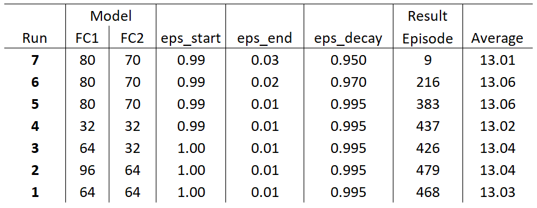
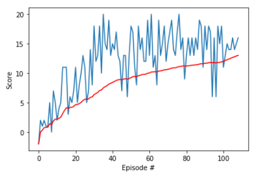
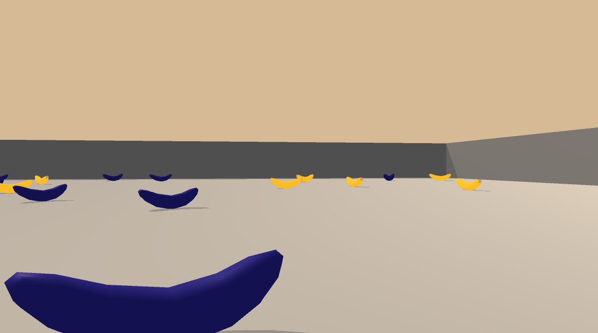
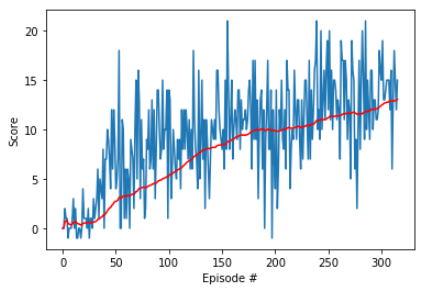

### Udacity Deep Reinforcement Learning Nanodegree - Project 1 - Navigation

# Report

See the `readme.md` for background information for the project and how to set up the environment. This report contains detail of the **Deep Q-Learning** learning algorithm and model architecture used, and results of experimentation with the architecture.

## 1. The Learning algorithm 

### Reinforcement Learning Summary
<div>
 
</div>

*The agent-environment interaction in reinforcement learning. (Source: Sutton and Barto, 2017)*

- The reinforcement learning (RL) framework is characterized by an **agent** learning to interact with its **environment**.
- At each time step, the agent receives the environment's **state** (_the environment presents a situation to the agent_), and the agent must choose an appropriate **action** in response. One time step later, the agent receives a **reward** (_the environment indicates whether the agent has responded appropriately to the state_) and a new **state**.
- All agents have the goal to maximize expected cumulative reward, or the expected sum of rewards attained over all time steps.


### Q-Learning Summary

See [Qrash Course](https://towardsdatascience.com/qrash-course-deep-q-networks-from-the-ground-up-1bbda41d3677) and [Exploration in Reinforcement Learning](https://towardsdatascience.com/exploration-in-reinforcement-learning-e59ec7eeaa75) blog posts, and  [Wikipedia Q-Learning](https://en.wikipedia.org/wiki/Q-learning) article for background on Reinforcement Learning and Q-Learning. 

*Qrash:* "A Reinforcement Learning task is about training an *Agent* which interacts with its *Environment*. The Agent transitions between different scenarios of the Environment, referred to as *states*, by performing *actions*. Actions, in return, yield *rewards*, which could be positive, negative or zero. The Agent’s sole purpose is to maximize the total reward it collects over an *episode*, which is everything that happens between an initial state and a terminal state. Hence, we *reinforce* the Agent to perform certain actions by providing it with positive rewards, and to stray away from others by providing negative rewards. This is how an Agent learns to develop a strategy, or a *policy*."  

*Wikipedia:* "Q-learning finds a policy that is optimal in the sense that it maximizes the expected value of the total reward over any and all successive steps, starting from the current state".

The goal of the agent is to choose the sequence of actions that will eventually generate the highest possible reward. The Q-Learning algorithm must work within a given environment and train the agent to optimally learn from its positive and negative feedbacks, simultaneously with a reference to the long-term goal of completion with the maximum reward. A positive reward should lead to making more actions that will score positively in an accelerated fashion, that is - to exploit knowledge about what has worked so far. 

This is known as a `greedy policy`. However, it should not focus on the earliest positive actions to the exclusion of any further explorations which might lead to more learning and even better actions - so the model must still explore new actions. This is described as the *exploration vs exploitation dilemma*. 

To enforce continued exploration the greedy policy is ameliorated by a factor that introduces a degree of randomness - thus ensuring new choices are made. However, as the model establishes for sure what are the best actions then this randomness should reduce or *decay*. The greek symbol `epsilon` **$ε$** is used to describe the adjustment factor, and the improved policy is known as an `epsilon greedy policy`. It has a starting rate for the amount of random choice, a decay rate to gradually decrease the randomness, and a finishing rate.  

### The Q-Learning algorithm

The mathematical basis of Q-Learning is expressed in the so-called [Bellman Equation](https://en.wikipedia.org/wiki/Bellman_equation):

<div>
 
</div>

*Wikipedia*: It writes the "value" of a decision problem at a certain point in time in terms of the payoff from some initial choices and the "value" of the remaining decision problem that results from those initial choices.

That is, the sequence of actions that will eventually generate the highest reward. The cumulative reward is referred to as Q Value (an abbreviation of *Quality Value*).

So, the equation is saying:
- `Q(s, a)` expresses the *Quality Value* (Q Value) of state `s` and action `a`
- and is derived from the *immediate reward* of the current state and action choice `r(s, a)`
- plus the highest possible Q Value we can possibly derive from actions in states we can take after this choice `max a Q(s',a)`
- discounted by `gamma` to control the importance of long-term rewards versus the immediate reward

The **Q-Learning (Sarsamax)** algorithm is an implementation of this, and can be presented like this:

<div>
 
</div>

The learning rate establishes the size of the incremental steps the model must take. The discount factor is used the determine how much to balance current award with estimated future award. 

In more summary form the equation for updating (say) $Q(s_0, a_0)$ is:
    
<div>
 
</div>

##### &nbsp;

In Python code with a concrete example:
```python
Qsa = -3.2        # current Q(s,a)
alpha = 0.2       # learning rate
reward = -1       # current reward
gamma = 1         # discount factor (none if 1)
Qsa_next = -0.6   # optimal future value that would be obtained by this Qsa

# next Qsa that will be obtained...

((1 - alpha) * Qsa) + (alpha * (reward + gamma*Qsa_next))  

-2.88
```
##### &nbsp;

### Deep Q-Learning

Q-Learning requires keeping a table (**Q-Table**) of the scores and possible future scores of the states and actions so far explored (Q values). **Deep Q-Learning** harnesses the power of neural networks, where the neural net learns optimal behaviours with an *approximation* of Q values and stores them in its weights. 

The requirement to use an *epsilon greedy* policy is included through an occasional random choice for an action, rather than only following what the neural network has been determined as the best known path.

##### &nbsp;

## 2. The Agent

The [code](dqn_agent.py) for the Agent is located in `dqn_agent.py`. 

Some essential components of it are that it:
- consists of two neural networks, one for the current state and one for the target
- can evaluate the state and action space
- returns actions for the current state per the policy
- learns from the consequentual rewards 
- employs **Experience Replay Memory** to keep track of what actions have been previously taken 

#### Experience Replay
The [experience replay](dqn_agent.py) is a buffer of past experiences, consisting of tuples of state, action, reward, and next state. The Agent randomly samples from this to introduce a knowledge of what has worked in the past. That way it does not get stuck in the current state/action but can calculate a best approach with a memory of what has previously worked. As the Agent works repetitively through the state/action space it accumulates memory of what has worked best. It may even have discovered an state/action pair that was infrequently taken but that in hindsight was optimal, it can retrieve this from the replay buffer.

### The Agent's State & Action Space

The feedback system is very simple for this project: A reward of +1 is provided for collecting a yellow banana, and a reward of -1 is provided for collecting a blue banana. The goal of the agent is to move to and thereby collect as many yellow bananas as possible while avoiding blue bananas. Bananas are constantly being dropped into the environment, which is a large square surrounded by walls, so there is no permanent position for the bananas - the agent must observe and move towards yellow bananas as they arrive. 

There are only four actions the agent can take:
- **`0`** - move forward
- **`1`** - move backward
- **`2`** - turn left
- **`3`** - turn right

There are 37 dimensions in the Vector Observation space, corresponding to the velocity of the agent and the ray-based perception of objects around the agent's forward direction.

Experimentation showed that a quite greedy policy was effective, with a more rapid decay of epsilon leading to a sufficiently efficient model in a very short number of training cycles.

##### &nbsp;

## 3. The training loop

The Deep Q-Network training loop (**DQN**) for this project is adapted from the [DRLND solution](https://github.com/udacity/deep-reinforcement-learning/blob/master/dqn/solution/Deep_Q_Network_Solution.ipynb) for a Deep Q-Network agent that implements an OpenAI Gym LunarLander-v2 environment.  

The code is an iterative loop through trial and error experiments of actions per state, learning to favour positive rewards over negative ones. The OpenAI gym environment supplies the state/action information and rewards, the code must be organized to supply data to the Agent that can take actions and learn the best actions from them, whilst accumulating the consequent rewards until ultimately a goal is obtained. The goal is a score of at least 13 over 100 consecutive episodes, so the loop is stopped once that goal is reached.

```python
def dqn(n_episodes=2000, max_t=1000, eps_start=0.990, eps_end=0.01, eps_decay=0.995):
    """Deep Q-Learning.
    
    Params
    ======
        n_episodes (int): maximum number of training episodes
        max_t (int): maximum number of timesteps per episode
        eps_start (float): starting value of epsilon, for epsilon-greedy action selection
        eps_end (float): minimum value of epsilon
        eps_decay (float): multiplicative factor (per episode) for decreasing epsilon
    """
    scores = []                                                 # list of each episodes scores
    scores_avg = []                                             # list of average scores
    scores_window = deque(maxlen=100)                           # last 100 scores
    eps = eps_start                                             # initialize epsilon
    
    for i_episode in range(1, n_episodes+1):                    # for each episode
        env_info = env.reset(train_mode = True)[brain_name]     # reset the environment
        state = env_info.vector_observations[0]                 # get the current state    
        score = 0                                               # set up to score the current episode
        
        for t in range(max_t):                                  # for each timestep per episode
            action = agent.act(state, eps).astype(int)          # select an action from the agent (incl epsilon) 
            env_info = env.step(action)[brain_name]             # send the action to the environment 
            next_state = env_info.vector_observations[0]        # get the next state
            reward = env_info.rewards[0]                        # get the reward
            done = env_info.local_done[0]                       # see if episode has finished  
            agent.step(state, action, reward, next_state, done) # agent takes the next step
            state = next_state                                  # set current state to the next state
            score += reward                                     # accumulate reward
            if done:
                break 
        
        scores_window.append(score)                             # save most recent score to last 100
        scores.append(score)                                    # save most recent score
        scores_avg.append(np.mean(scores_window))               # save average of window
        
        eps = max(eps_end, eps_decay*eps)                       # decrease epsilon
        
        print('\rEpisode {}\tAverage Score: {:.2f}'.format(i_episode, np.mean(scores_window)), end="")
        
        if i_episode % 100 == 0:
            print('\rEpisode {}\tAverage Score: {:.2f}'.format(i_episode, np.mean(scores_window)))
        
        if np.mean(scores_window)>=13.0:
            print('\nEnvironment solved in {:d} episodes!\tAverage Score: {:.2f}'.format(i_episode-100, np.mean(scores_window)))
            torch.save(agent.qnetwork_local.state_dict(), 'checkpoint.pth')
            break
            
    return scores, scores_avg 
```    

##### &nbsp;

## 4. Parameters tested
- Neural Network model: 
    - A 3 layer fully conected neural network was used, per the example pattern
    - The default was a 64-64-4 node arrangement. 4 is required as the output as these are the 4 choices the agent must take, the input to the first layer is the 37 dimensions of the Vector Observation space
    - Other arrangements tested were:
        - 96-64-4
        - 64-32-4
        - 32-32-4
        - 88-70-4
    - The best results came from an 80-70-4 arrangement 
- Epsilon Start, End, and Decay
    - The defaults were 1.0, 0.01, and 0.995
    - 0.99, 0.01, 0.99 yelded essentailly the same result
    - experimented with 
        - increasing the End to 0.02 and 0.03 
        - decreasing the Decay to 0.97 and 0.95
    - best setting was 0.99, 0.02, 0.97 (see comparisons)

The conclusion after experimentation was to note that the model was somewhat responsive to number of nodes in the neural networks, but was *very* sensitive to changes in epsilon Decay and End. **If the "best" result is measured by how quickly the model attains a score of 13**, then decreasing the Decay rate to 0.95 made a signficant difference - see next table - the quickest performance was from run 7 using a Decay of 0.95 which got to a score of 13 after just 9 episodes...         

##### &nbsp;

## 5. Comparisons of parameters and results
<div>

</div>

##### &nbsp;

### The "best" training run
- Based on getting to an average of 13 soonest during training

####    Run 7
```
checkpoint_7.pth

eps_start=0.990, eps_end=0.03, eps_decay=0.95

Episode 100	Average Score: 11.90
Episode 109	Average Score: 13.01
Environment solved in 9 episodes!	Average Score: 13.01

QNetwork(
  (fc1): Linear(in_features=37, out_features=80, bias=True)
  (fc2): Linear(in_features=80, out_features=70, bias=True)
  (fc3): Linear(in_features=70, out_features=4, bias=True)
)
```
<div>

</div>

Although this run was the quickest to get the required score, in fact the other runs where the epsilon rate was not so strongly decreased are measurably better models - for instance the average for run 6 is 13.06 which is 0.05  better than run 7, at 13.01. 

**When the performance of the trained models was measured over 10 episodes, it was found that the actual best model was the one coming from run 6.**

The run 7 model had a poorer strategy for not getting stuck behind a blue banana whereas the other models did better (they all got stuck sometimes). That is, when encountering a blue banana in some positions the agent's point of view would just oscillate wildly left and right but not back off and move around the banana - getting stuck and therefore not scoring well. The agent trained in Run 7 did worse in this scenario, and the agent trained in Run 6 did best.

<div>

</div>

*Stuck behind a blue banana*

### The **actual** best training run
- Based on getting the best scores with a trained model

####    Run 6
```
checkpoint_6.pth

eps_start=0.990, eps_end=0.02, eps_decay=0.97

Episode 100    Average Score: 5.19
Episode 200    Average Score: 9.930
Episode 300    Average Score: 12.35
Episode 316    Average Score: 13.06
Environment solved in 216 episodes!    Average Score: 13.06

QNetwork(
  (fc1): Linear(in_features=37, out_features=80, bias=True)
  (fc2): Linear(in_features=80, out_features=70, bias=True)
  (fc3): Linear(in_features=70, out_features=4, bias=True)
)
```
<div>

</div>

##### &nbsp;

## 6. Comparing trained models
As described above, when trained models were assessed over 10 runs then the model obtained on run 6 performed the best. The following are test run results for the agent trained on run 6 vs the agent trained on run 7. The run 6 agent consistently performs better, only falling below 13 on one episode in each group. 
The other models were also evaluated with test runs and none of them did as well as the Run 6 model.

```
Agent trained on Run 6
Episode 1    Average Score: 17.00
Episode 2    Average Score: 18.50
Episode 3    Average Score: 15.33
Episode 4    Average Score: 12.50
Episode 5    Average Score: 13.00
Episode 6    Average Score: 14.17
Episode 7    Average Score: 15.14
Episode 8    Average Score: 14.88
Episode 9    Average Score: 15.33
Episode 10   Average Score: 15.30
```
```
Agent trained on Run 6
Episode 1    Average Score: 11.00
Episode 2    Average Score: 14.50
Episode 3    Average Score: 15.67
Episode 4    Average Score: 16.00
Episode 5    Average Score: 17.80
Episode 6    Average Score: 18.00
Episode 7    Average Score: 16.00
Episode 8    Average Score: 15.12
Episode 9    Average Score: 15.56
Episode 10   Average Score: 15.70
```
```
Agent trained on Run 7
Episode 1    Average Score: 6.00
Episode 2    Average Score: 11.50
Episode 3    Average Score: 8.67
Episode 4    Average Score: 10.75
Episode 5    Average Score: 11.60
Episode 6    Average Score: 11.33
Episode 7    Average Score: 12.00
Episode 8    Average Score: 11.75
Episode 9    Average Score: 12.56
Episode 10   Average Score: 13.80
```
```
Agent trained on Run 7
Episode 1    Average Score: 22.00
Episode 2    Average Score: 12.00
Episode 3    Average Score: 9.33
Episode 4    Average Score: 10.75
Episode 5    Average Score: 11.00
Episode 6    Average Score: 11.33
Episode 7    Average Score: 12.43
Episode 8    Average Score: 13.00
Episode 9    Average Score: 13.11
Episode 10   Average Score: 13.60
```

See the notebook for detailed results of the tests and the other runs...

##### &nbsp;

## 7. Ideas for future work

This is a basic implementation of Deep Q-Learning. There are other methods that have been proven to adjust for the weaknesses in the basic approach, which are that the model can innacurately estimate the correct repsonses based just on what it has discovered by chance. 

These ideas are taken from [Deep Q-Learning Improvements](https://classroom.udacity.com/nanodegrees/nd893-ent/parts/b5175725-8f50-4cd9-8666-fd4c1375039c/modules/56dab924-27c9-43ab-b898-3bdab18f6fd2/lessons/4adf70aa-0c4c-4a48-8bbe-e3619874f234/concepts/9cf78c93-e31a-40a1-bea3-c0f3509fd2f3) in the Udacity Deep Reinforcement Learning Nanodegree...

#### a. Double Deep Q-Network (DDQN)
Deep Q-Learning [tends to overestimate](https://www.ri.cmu.edu/pub_files/pub1/thrun_sebastian_1993_1/thrun_sebastian_1993_1.pdf) action values. [Double Q-Learning](https://arxiv.org/abs/1509.06461) has been shown to work well in practice to help with this. In DDQN the discovery and evaluation of the best actions are separated.  

#### b. Prioritized Experience Replay
Deep Q-Learning samples experience transitions uniformly from a replay memory. [Prioritized experienced replay](https://arxiv.org/abs/1511.05952) is based on the idea that the agent can learn more effectively from some transitions than from others, and the more important transitions should be sampled with higher probability.

#### c. Dueling DQN
With standard DQN, in order to determine which states are (or are not) valuable, we have to estimate the corresponding action values for each action. However, by replacing the traditional Deep Q-Network (DQN) architecture with a [dueling architecture](https://arxiv.org/abs/1511.06581), we can assess the value of each state, without having to learn the effect of each action. 

#### d. Noisy DQN
With [Noisy DQN](https://arxiv.org/abs/1706.10295) noise is added to the weights to add an irregularity to the agent's policy, which can result in more varied exploration and the discovery of better strategies.

#### e. Rainbow
In addition to the 4 improvements introduced above, [Rainbow](https://arxiv.org/abs/1710.02298) adds another two - [multi-step bootstrap targets](https://arxiv.org/abs/1602.01783) and [Distributional DQN](https://arxiv.org/abs/1707.06887). All of these six improvements address different issues with DQN, Rainbow combines them to create a model that vastly outperforms any one of them including of course the original DQN:

<div>

</div>

##### &nbsp;
